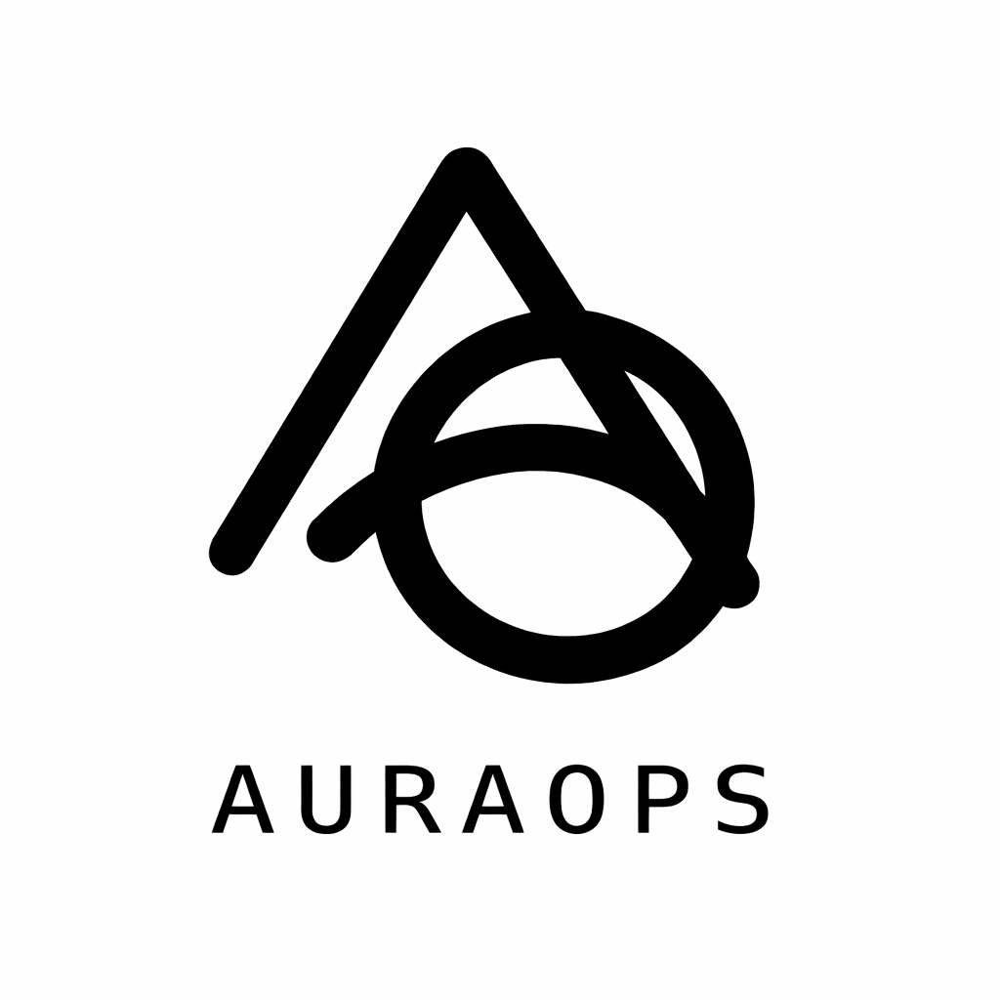

<!--
█████╗ ██╗   ██╗██████╗  █████╗  ██████╗ ██████╗ ███████╗
██╔══██╗██║   ██║██╔══██╗██╔══██╗██╔═══██╗██╔══██╗██╔════╝
███████║██║   ██║██████╔╝███████║██║   ██║██████╔╝███████╗
██╔══██║██║   ██║██╔══██╗██╔══██║██║   ██║██╔═══╝ ╚════██║
██║  ██║╚██████╔╝██║  ██║██║  ██║╚██████╔╝██║     ███████║
╚═╝  ╚═╝ ╚═════╝ ╚═╝  ╚═╝╚═╝  ╚═╝ ╚═════╝ ╚═╝     ╚══════╝
-->

<div align="center">



# AuraOps

### Your AI Agent Works Locally. Breaks in Production. Not Anymore.

<p>
  <a href="https://auraops.vercel.app"></a>
  <a href="https://github.com/krishkumar1577/AuraOps_backend"></a>
</p>

<p>
  
  
  
  
</p>

</div>

---

## 🎬 Demo

<!-- ─────────────────────────────────────────────────────────────
     DROP YOUR DEMO HERE — one line, that's it
     
     YouTube:
     [](https://youtube.com/watch?v=YOUR_ID)

     Loom:
     [](https://loom.com/share/YOUR_ID)
     ───────────────────────────────────────────────────────────── -->

> 🎥 **Demo dropping soon** — `auraops deploy` shipping a LangChain agent live in 26 seconds.

---

## What Is This Repo?

The marketing site for **AuraOps** — an AI deployment platform that eliminates the Infrastructure Tax.

```
┌─────────────────────────────────────────────────────┐
│  This repo  →  Landing page  (auraops.vercel.app)   │
│  Backend    →  Deployment engine  (AuraOps_backend) │
└─────────────────────────────────────────────────────┘
```

Looking for the actual engine that deploys AI agents in 30 seconds?
👉 **[AuraOps_backend](https://github.com/krishkumar1577/AuraOps_backend)**

---

## Stack

| Layer | Tech |
|---|---|
| Framework | React 18 |
| Language | TypeScript (strict) |
| Styling | Tailwind CSS v4 |
| Build | Vite |
| Deploy | Vercel (auto on push to `main`) |

---

## Run Locally

```bash
git clone https://github.com/krishkumar1577/AuraOps.git
cd AuraOps
npm install
npm run dev
# → http://localhost:5173
```

```bash
npm run build      # production build
npm run preview    # preview production locally
npm run lint       # ESLint check
```

---

## Project Structure

```
src/
├── App.tsx          # Root component
├── index.css        # Global styles + Tailwind
├── main.tsx         # Entry point
└── assets/          # Static assets

public/
└── auraops-logo.png
```

---

## Contributing

Found a bug or want to improve the site? PRs are welcome.

1. Fork the repo
2. Create your branch: `git checkout -b fix/your-fix`
3. Commit: `git commit -m 'fix: description'`
4. Push: `git push origin fix/your-fix`
5. Open a PR

---

<div align="center">

```
$ auraops deploy --provider lambda-labs
✓ Blueprint generated      (0.4s)
✓ Weights cached           (<1ms)
✓ GPU acquired             (0.8s)
✓ Health check passed      (3.2s)
🚀 Live in 26.8s
```

**[⭐ Star the backend](https://github.com/krishkumar1577/AuraOps_backend)**  · **[🐛 Report a bug](https://github.com/krishkumar1577/AuraOps/issues)**

*Deleting the Infrastructure Tax, one deploy at a time.*

</div>
